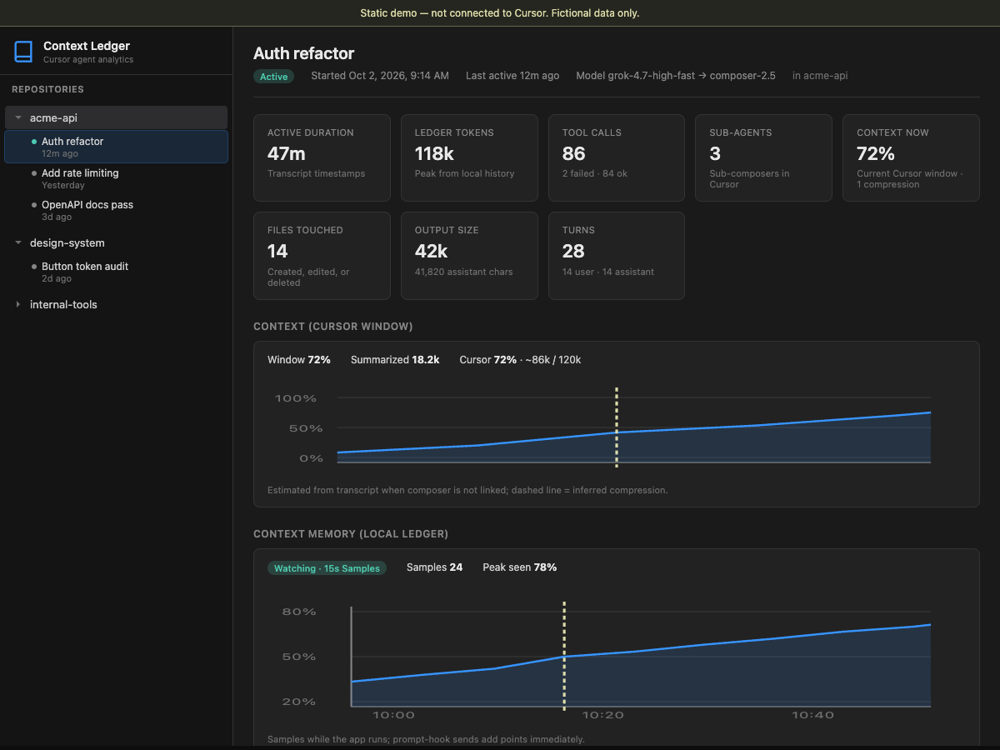
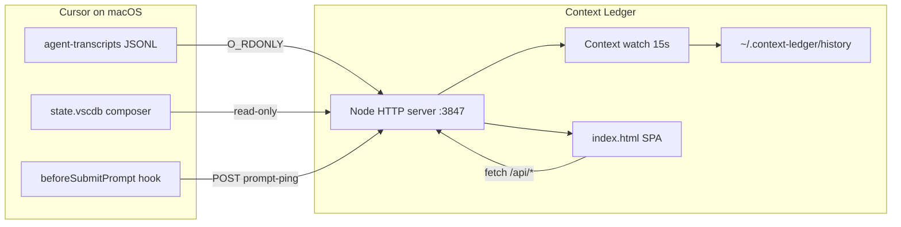

# Context Ledger

**See how your Cursor agent chats use context, tools, and time — locally, on your Mac.**

Context Ledger is a read-only dashboard for Cursor IDE agent sessions. It scans agent transcript logs, optionally merges live composer context from Cursor’s global storage, and serves a single-page app on `localhost`. No cloud, no account, no writes into Cursor’s data directories.



**[Static demo](demo/dashboard-preview.html)** — open in a browser with fictional data ([`demo/README.md`](demo/README.md)).

## Why it exists

Agent chats are opaque: context fills up, tools pile on, sub-agents spawn, and it’s hard to see *what* consumed the window or *when* compression happened. Context Ledger turns existing Cursor files on disk into a repo sidebar, per-chat metrics, composition breakdowns, and a local context-memory timeline while the server is running.

## Key features

- **Repo & chat sidebar** — workspaces under `~/.cursor/projects/`, chats from agent transcript JSONL
- **Per-chat dashboard** — duration, turns, tool calls, files touched, assistant output size, sub-agents
- **Context window** — current % and token breakdown when composer id matches Cursor global storage; estimates from transcript otherwise
- **Context composition** — horizontal bars per bucket (system, tools, rules, skills, MCP, conversation, summarized), whole-window mix strip, last prompt samples from the hook
- **Context memory chart** — time series from `~/.context-ledger/history/` (15s watcher + prompt-hook points), axes, inferred summarization markers
- **Tools, skills, agents, commands** — counts and mix from transcript tool calls
- **Models used** — transcript metadata plus per-send model from the optional prompt hook
- **Repo-level aggregates** — rollups when no single chat is selected

## Metrics & data sources

| UI area | What it shows | Primary source | Notes |
|--------|----------------|----------------|-------|
| Sidebar repos/chats | Names, status, recency | **Transcript** (`agent-transcripts/*.jsonl`) | v1 lists agent sessions only |
| Tool calls, skills, files, turns | Usage counts & failures | **Transcript** | Parsed from JSONL tool/user/assistant events |
| Context now / composition bars | Token buckets in the prompt window | **Composer** (`globalStorage/state.vscdb`, read-only) | When transcript id matches a composer session |
| Context % without composer link | Estimated series & compression count | **Transcript** | Labeled as estimated in the UI |
| Context memory (ledger) chart | % or tokens over time | **Ledger** (`~/.context-ledger/history/<id>.jsonl`) | Written only by this app while `npm start` runs |
| Last N prompt bars | Window at each send | **Ledger** (`trigger: user_prompt`) | Requires hook → `POST /api/prompt-ping` |
| Models used | Model id chain | **Transcript** + **Ledger** (hook) | Hook adds a model per send going forward |
| Sub-agents | Task / cursor.Task spawns | **Transcript** | |

**Transcript** = durable agent log Cursor already wrote. **Composer** = read-only SQLite state Cursor uses for the IDE context meter. **Ledger** = optional local history this project writes under `~/.context-ledger/`.

## Architecture



1. **Discover** — walk `~/.cursor/projects/*/agent-transcripts`, parse JSONL into chat objects (`server/discover.js`, parsers).
2. **Enrich** — for matching composer ids, read `promptTokenBreakdown` and usage from global storage (`server/cursor-composer.js`).
3. **Serve** — cache aggregated JSON for 30s; static `index.html` renders charts and tables in the browser.
4. **Watch** (optional) — every 10m add up to 5 recently active composers; every 15s sample context into the ledger until idle &gt; 1h.
5. **Hook** (optional) — on each prompt send, append a ledger row without blocking the user (`hooks/prompt-ping.sh`).

## Prerequisites

- **macOS** (paths and composer storage layout are Mac-oriented today)
- **Node.js** 18+ (ES modules, no build step)
- **Cursor** with agent transcripts under `~/.cursor/projects/<workspace>/agent-transcripts/*.jsonl`
- Composer-linked metrics need Cursor’s `Library/Application Support/Cursor/User/globalStorage/state.vscdb` (read-only)

## Quick start

```bash
git clone <your-fork-url>
cd context-ledger
npm install   # no dependencies required today; safe to run
npm start
```

Open [http://localhost:3847](http://localhost:3847).

Refresh cached scan: `curl http://localhost:3847/api/refresh` or reload after ~30s.

Preview the UI without Cursor: `npm run demo` or open [`demo/dashboard-preview.html`](demo/dashboard-preview.html).

## Optional: prompt hook (per-send composition)

To record context composition **at each prompt send** (and capture model id for that send), wire Cursor’s command hook to the included script.

1. Copy or symlink `hooks/prompt-ping.sh` somewhere on your PATH (or reference it by relative path from your Cursor config).
2. Add a `beforeSubmitPrompt` entry in `~/.cursor/hooks.json` (create the file if needed):

```json
{
  "hooks": {
    "beforeSubmitPrompt": [
      {
        "command": "/path/to/context-ledger/hooks/prompt-ping.sh"
      }
    ]
  }
}
```

Replace `/path/to/context-ledger` with your clone location. The script POSTs to `http://127.0.0.1:3847/api/prompt-ping`, returns `{"continue":true}` immediately, and does not call a model. If the server is not running, the ping is skipped.

## Privacy & read-only guarantees

- **Cursor directories** — opens files with `O_RDONLY` only (`server/read-only.js`). No writes to `~/.cursor` or Application Support.
- **Local ledger** — the only writes are append-only JSONL under `~/.context-ledger/history/` while the server runs.
- **Network** — default bind is localhost; data never leaves your machine unless you expose the port yourself.
- **Hook** — fire-and-forget HTTP to `127.0.0.1`; 1s timeout; failures are ignored.

## API (summary)

| Method | Path | Description |
|--------|------|-------------|
| `GET` | `/api/data` | Repositories, chats, parsed metrics (30s cache) |
| `GET` | `/api/refresh` | Clear cache and rebuild |
| `GET` | `/api/history/<composer-uuid>` | Ledger points + stats for one chat |
| `GET` | `/api/watch/status` | Active context-watch set |
| `POST` | `/api/prompt-ping` | Body: `{ conversationId, generationId, model? }` — async ledger append |
| `GET` | `/` | SPA (`index.html`) |

## Roadmap & limitations (honest)

- **v1 transcripts only** — Composer UI chats in `~/.cursor/chats/.../store.db` are not ingested yet; you only see chats with agent JSONL.
- **macOS-first** — Linux/Windows paths not fully mapped.
- **Estimates** — without composer link, context % and compression are inferred from transcript, not identical to Cursor’s meter.
- **Model history** — full per-send model chain needs the prompt hook; older sessions may only show transcript model metadata.
- **Watch cap** — at most five warm chats sampled every 15s; not a full audit log of every session.
- **No auth** — intended for single-user local use.

## Contributing

Issues and PRs welcome. Run tests before submitting:

```bash
npm test
```

Please avoid committing real chat titles or paths from your machine in screenshots or fixtures.

## License

[MIT](LICENSE)
